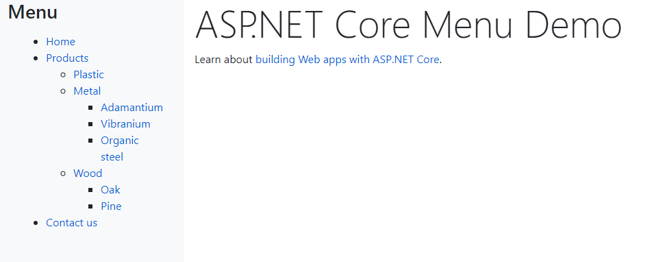

# ASP.NET Core menu demo
This is an ASP.NET Core 5 application which shows how to cache and render a hierarchical menu.

 

 ## Features

 - Menu items are provided by the infrastrastructural service [Models/Services/Infrastructure/FakeMenuRepository.cs]([Models/Services/Infrastructure/FakeMenuRepository.cs]). Each menu items has an `Id` and a `ParentId`;
 - The menu item flat list is then converted into a hierarchical structure by the application service [Models/Services/Application/CachedMenuService.cs]([Models/Services/Application/CachedMenuService.cs]) which then puts said structure in the memory cache;
 - The tag helper [TagHelpers/NavigationMenuTagHelper.cs](TagHelpers/NavigationMenuTagHelper.cs) then renders the hierarchical structure recursively. Menu items are shown only if the current user has the required role.